# 🧾 Detailed Tutorial: Multi-Signature Escrow Smart Contract

This tutorial covers a sophisticated multi-signature escrow smart contract (`PublicFund.hs`) that enables secure fund management with approval workflows. The contract supports deposit locking, official approvals, beneficiary releases, and depositor refunds under specific conditions.

---

## 📚 Table of Contents

1. [🏗️ Architectural Overview](#1-architectural-overview)
2. [📦 Imports Overview](#2-imports-overview)
3. [🗃️ Data Structures](#3-data-structures)
4. [🧠 Core Validator Logic](#4-core-validator-logic)
5. [⚙️ Validator Script Compilation](#5-validator-script-compilation)
6. [🔌 Off-Chain Implementation](#6-off-chain-implementation)
7. [🔄 Complete Workflow Example](#7-complete-workflow-example)
8. [🧪 Testing Strategy](#8-testing-strategy)
9. [✅ Best Practices](#9-best-practices)
10. [📘 Glossary of Terms](#10-glossary-of-terms)

---

## 1. 🏗️ Architectural Overview

### System Architecture


### Workflow Sequence

```mermaid
sequenceDiagram
    participant D as Depositor (Wallet 1)
    participant O1 as Official 1 (Wallet 3)
    participant O2 as Official 2 (Wallet 4)
    participant B as Beneficiary (Wallet 2)
    participant SC as Smart Contract
    participant BC as Blockchain
    
    Note over D,B: Phase 1: Fund Locking
    D->>SC: lock() with 10 ADA
    SC->>BC: Create UTxO with datum
    
    Note over D,B: Phase 2: Approvals (before deadline)
    O1->>SC: approve()
    SC->>BC: Update datum<br/>approvals: [O1]
    
    O2->>SC: approve()
    SC->>BC: Update datum<br/>approvals: [O1, O2]
    
    Note over D,B: Phase 3: Release
    B->>SC: release()
    SC->>BC: Validate: 2 approvals ≥ required<br/>Validate: before deadline<br/>Validate: beneficiary signature
    BC->>B: Transfer 10 ADA
    
    Note over D,B: Alternative: Refund Scenario
    alt Insufficient approvals by deadline
        D->>SC: refund()
        SC->>BC: Validate: after deadline<br/>Validate: approvals < required<br/>Validate: depositor signature
        BC->>D: Return 10 ADA
    end
```



---

## 2. 📦 Imports Overview

### On-Chain Imports (`PublicFund.hs`)

* **Plutus.V2.Ledger.Api:**
  Core types: `POSIXTime`, `PubKeyHash`, `Validator`, `ScriptContext`, `TxInfo`.

* **Plutus.V2.Ledger.Contexts:**
  Transaction context utilities: `scriptContextTxInfo`, `txInfoSignatories`.

* **Plutus.V1.Ledger.Interval:**
  Time interval operations: `contains`, `to`, `from`.

* **PlutusTx:**
  Compilation and serialization: `compile`, `unstableMakeIsData`.

### Off-Chain Imports (`Main.hs`)

* **Plutus.Contract:**
  Contract monad and endpoints: `Contract`, `Endpoint`, `submitTxConstraints`.

* **Plutus.Trace.Emulator:**
  Testing framework: `EmulatorTrace`, `activateContractWallet`.

* **Ledger:**
  Address and transaction utilities: `scriptAddress`, `mustPayToTheScript`.

---

## 3. 🗃️ Data Structures

### `EscrowDatum` - On-Chain State
```haskell
data EscrowDatum = EscrowDatum
    { edDepositor   :: PubKeyHash    -- Who locked the funds
    , edBeneficiary :: PubKeyHash    -- Who can receive funds
    , edOfficials   :: [PubKeyHash]  -- List of authorized officials (m)
    , edApprovals   :: [PubKeyHash]  -- Collected approvals so far
    , edRequired    :: Integer       -- Required approvals (n ≤ m)
    , edDeadline    :: POSIXTime     -- Time limit for approvals
    }
```
*Purpose*: Stores the complete state of the escrow contract on-chain.

### `EscrowAction` - Redeemer Types
```haskell
data EscrowAction
    = Approve   -- Official approves the release
    | Release   -- Beneficiary claims funds
    | Refund    -- Depositor recovers funds
```
*Purpose*: Defines the three possible actions that can be performed on the escrow.

---

## 4. 🧠 Core Validator Logic

### Helper Functions

```haskell
-- Check if transaction signed by specific key
signedBy :: PubKeyHash -> ScriptContext -> Bool

-- Check if transaction occurs before deadline
beforeDeadline :: POSIXTime -> ScriptContext -> Bool

-- Check if transaction occurs after deadline
afterDeadline :: POSIXTime -> ScriptContext -> Bool

-- Ensure official hasn't approved before and is authorized
uniqueApproval :: PubKeyHash -> EscrowDatum -> Bool
```

### Main Validator Logic

#### **Approve Action** (Official)
```haskell
Conditions:
1. Transaction must occur BEFORE deadline
2. Exactly one signer required
3. Signer must be in officials list
4. Signer must NOT have approved before
```

#### **Release Action** (Beneficiary)
```haskell
Conditions:
1. Transaction must occur BEFORE deadline
2. Collected approvals ≥ required approvals
3. Beneficiary must sign the transaction
```

#### **Refund Action** (Depositor)
```haskell
Conditions:
1. Transaction must occur AFTER deadline
2. Collected approvals < required approvals
3. Depositor must sign the transaction
```

### Validator Implementation
```haskell
mkValidator :: EscrowDatum -> EscrowAction -> ScriptContext -> Bool
mkValidator d act ctx = case act of
    Approve  -> checkApprove d ctx
    Release  -> checkRelease d ctx
    Refund   -> checkRefund d ctx
```

---

## 5. ⚙️ Validator Script Compilation

```haskell
-- Convert typed validator to untyped version
mkValidatorUntyped :: BuiltinData -> BuiltinData -> BuiltinData -> ()

-- Compile to Plutus Core
validator :: Validator
validator = mkValidatorScript $$(PlutusTx.compile [|| mkValidatorUntyped ||])
```

---

## 6. 🔌 Off-Chain Implementation

### Contract Schema
```haskell
type EscrowSchema =
        Endpoint "lock" ()
    .\/ Endpoint "approve" ()
    .\/ Endpoint "release" ()
    .\/ Endpoint "refund" ()
```

### Script Address
```haskell
escrowAddress :: Address
escrowAddress = scriptAddress validator
```

### Endpoint Functions

#### **Lock Endpoint**
```haskell
lock :: Contract () EscrowSchema Text ()
lock = do
    -- Create datum with initial state
    let datum = EscrowDatum { ... }
    -- Submit transaction locking funds
    submitTxConstraints validator $
        mustPayToTheScript datum (Ada.lovelaceValueOf 10_000_000)
```

#### **Approve Endpoint**
```haskell
approve :: Contract () EscrowSchema Text ()
approve = do
    -- Find script UTxO
    utxos <- utxosAt escrowAddress
    -- Submit approval transaction
    submitTxConstraintsSpending validator utxos $
        mustSpendScriptOutput oref (Redeemer $ toBuiltinData Approve)
```

#### **Release Endpoint**
```haskell
release :: Contract () EscrowSchema Text ()
release = do
    -- Similar to approve but with Release redeemer
    -- Must be called by beneficiary after sufficient approvals
```

### Emulator Trace
```haskell
trace :: EmulatorTrace ()
trace = do
    -- Activate depositor wallet
    h1 <- activateContractWallet (knownWallet 1) lock
    waitNSlots 1
    
    -- Activate official 1 for approval
    h3 <- activateContractWallet (knownWallet 3) approve
    waitNSlots 1
    
    -- Activate official 2 for approval
    h4 <- activateContractWallet (knownWallet 4) approve
    waitNSlots 1
    
    -- Activate beneficiary for release
    h2 <- activateContractWallet (knownWallet 2) release
    waitNSlots 1
```

---

## 7. 🔄 Complete Workflow Example

### State Transition Diagram


### Step-by-Step Execution

```haskell
-- 1. Initial Setup
let depositor = knownWallet 1
    beneficiary = knownWallet 2
    officials = [knownWallet 3, knownWallet 4]
    deadline = 20_000  -- POSIX time
    requiredApprovals = 2

-- 2. Create initial datum
let initialDatum = EscrowDatum
    { edDepositor = mockWalletPaymentPubKeyHash depositor
    , edBeneficiary = mockWalletPaymentPubKeyHash beneficiary
    , edOfficials = map mockWalletPaymentPubKeyHash officials
    , edApprovals = []  -- No approvals yet
    , edRequired = requiredApprovals
    , edDeadline = deadline
    }

-- 3. Lock funds (executed by depositor)
-- Transaction creates UTxO at script address with datum

-- 4. Official 1 approves
-- Transaction spends script UTxO, adds official's pubkey to approvals list

-- 5. Official 2 approves
-- Transaction spends script UTxO again, updates approvals list

-- 6. Beneficiary releases funds
-- Transaction spends final UTxO, sends funds to beneficiary
```

### Expected State Transitions
```
Initial:  [Depositor: Wallet1, Approvals: []]
Step 1:   [Depositor: Wallet1, Approvals: [Wallet3]]
Step 2:   [Depositor: Wallet1, Approvals: [Wallet3, Wallet4]]
Final:    Funds transferred to Wallet2 (Beneficiary)
```

---

## 8. 🧪 Testing Strategy

### Test Coverage Matrix

| Test Case | Action Sequence | Expected Result |
|-----------|----------------|-----------------|
| Happy Path | lock → approve ×2 → release | Success, funds released |
| Insufficient Approvals | lock → approve ×1 → refund after deadline | Success, funds refunded |
| Double Approval | lock → approve → approve (same official) | Failure |
| Early Refund | lock → refund before deadline | Failure |
| Unauthorized Release | lock → approve ×2 → release (not beneficiary) | Failure |
| Late Release | lock → approve ×2 → release after deadline | Failure |

### Emulator Testing
```haskell
testFullWorkflow :: EmulatorTrace ()
testFullWorkflow = do
    -- Test successful flow
    void $ activateContractWallet w1 lock
    void $ activateContractWallet w3 approve
    void $ activateContractWallet w4 approve
    void $ activateContractWallet w2 release
    
    -- Check final balances
    assertBalance w2 (Ada.lovelaceValueOf 10_000_000)
```

---

## 9. ✅ Best Practices

### Security Considerations
1. **Signature Validation**: Always verify signers match expected roles
2. **Time Validation**: Use `beforeDeadline`/`afterDeadline` appropriately
3. **State Consistency**: Ensure datum updates correctly track approvals

### Code Quality
1. **Clear Trace Messages**: Use `traceIfFalse` with descriptive messages
2. **Input Validation**: Check list lengths and element uniqueness
3. **Error Handling**: Handle edge cases in off-chain code

### Gas Optimization
1. **Minimal On-Chain Logic**: Keep validator functions simple
2. **Efficient Data Structures**: Use appropriate list operations
3. **Batch Operations**: Where possible, combine actions

---

## 10. 📘 Glossary of Terms

| Term | Definition |
|------|------------|
| **Escrow** | Financial arrangement where assets are held by third party until conditions met |
| **Datum** | On-chain data storing contract state (approvals, parties, deadlines) |
| **Redeemer** | Action type specifying what operation to perform |
| **m-of-n Approval** | Requires m approvals out of n possible officials |
| **POSIXTime** | Unix timestamp used for deadline tracking |
| **PubKeyHash** | Cryptographic hash identifying a wallet |
| **UTxO** | Unspent Transaction Output, fundamental unit of Cardano ledger |
| **Script Address** | Address derived from validator script hash |
| **Endpoint** | Off-chain interface for interacting with contract |
| **Emulator Trace** | Testing framework for simulating blockchain interactions |

---

## 🎯 Key Takeaways

1. **Flexible Approval System**: The contract supports any m-of-n approval scheme
2. **Time-Based Fallbacks**: Automatic refund if approvals insufficient by deadline
3. **Role-Based Access**: Clear separation between depositor, officials, beneficiary
4. **State Tracking**: On-chain datum tracks approval progress
5. **Comprehensive Testing**: Full emulator trace validates all scenarios

This multi-signature escrow contract provides a robust foundation for implementing governance-controlled fund release mechanisms, suitable for DAOs, corporate treasuries, or grant disbursement systems.

---

## 🔗 Related Resources

- [Plutus Documentation](https://plutus.readthedocs.io/)
- [Cardano Developer Portal](https://developers.cardano.org/)
- [Mermaid.js Documentation](https://mermaid-js.github.io/mermaid/)
- [Plutus Pioneer Program](https://plutus-pioneer-program.readthedocs.io/)

---

*Note: This tutorial assumes familiarity with Haskell, Plutus, and basic blockchain concepts. For beginners, start with the Plutus Pioneer Program materials.*
